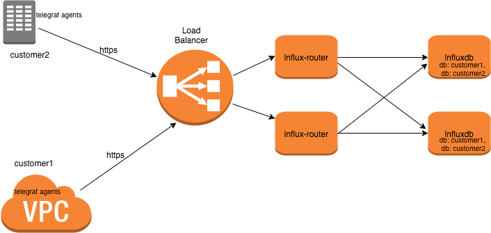
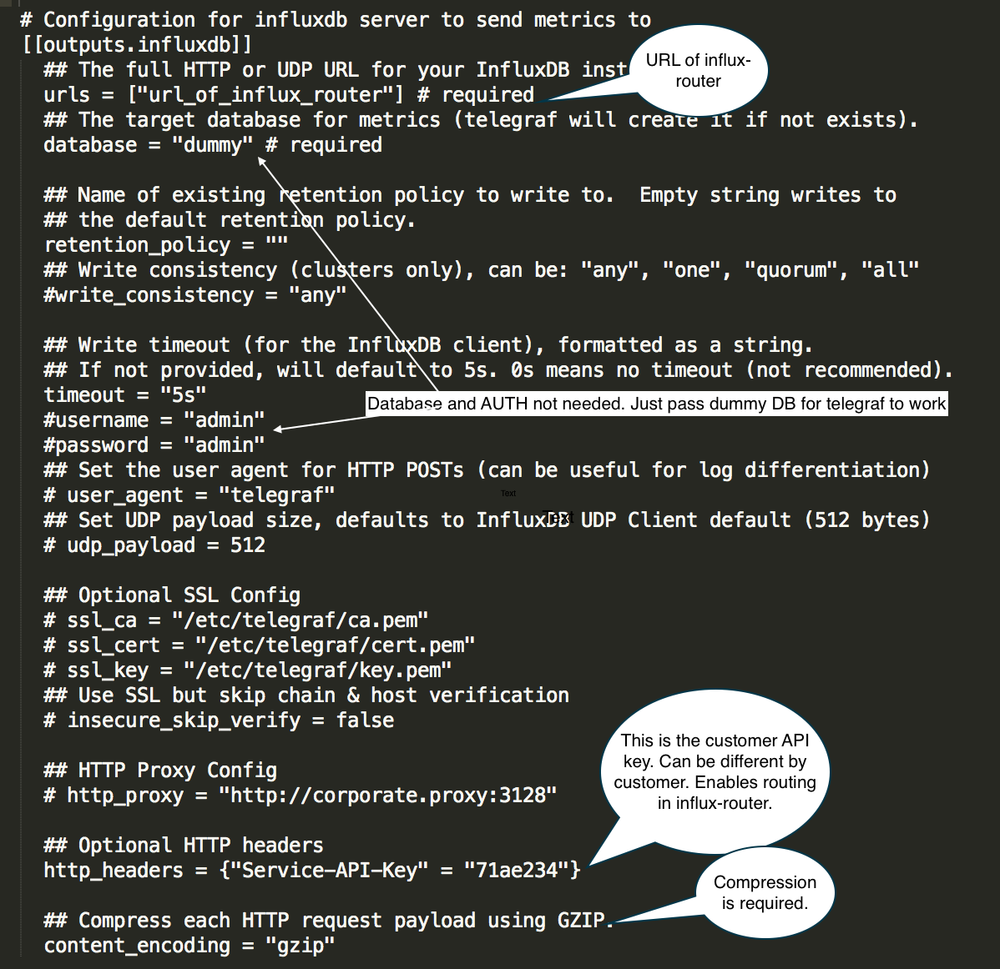

# NOT PRODUCTION READY YET.
### Metric flow with influxdb-router (Typical use case)


Installation
-------------------
##### To build from source follow the steps below: 

```sh
Install glide from http://glide.sh/.

$ go get -u github.com/samitpal/influxdb-router/...

$ glide install

$ go install
```

### Influxdb-router Usage
```
With the config in config.toml (containing the InfluxDB creds) and with InfluxDB authentication enabled in the backends

$./influxdb-router -auth-enabled -auth-mode from-config -config_file config.toml -api-listen-http-port 8090 -listen-http-port 8080

With the config in config.toml (without the InfluxDB creds) and with InfluxDB authentication enabled in the backends, you can set the creds in environment in the following format

$ export username_<api_key> = "user1"
$ export password_<api_key> = "password1"

and then

$ ./influxdb-router -auth-enabled -auth-mode from-env -config_file config.toml -api-listen-http-port 8090 -listen-http-port 8080
```
### Sample config.toml
```
[[customers]]
  name = "servicex"
  email = "user1@email.com"
  # api key should not have !, *, or - character. This is the value of the telegraf header (default header name is 'Service-API-Key')
  api_key = "7ba4e75a"
  # Name of the influxdb database where the metrics for this customer should be stored.
  influx_db_name = "telegraf1"
  # Max number of batches that will be kept in-memory for each of the 'influx_hosts'. Beyind that batches with be dropped
  outgoing_queue_cap = 7000
  # Influxdb-routed maintains a retry queue for batches that it fails to send to InfluxDB backends.
  # retry_queue_cap is the max number of batches that can be kept in the retry queue (in-memory).
  retry_queue_cap = 10
  # list of InfluxDB hosts.
  influx_hosts = ["http://127.0.0.1:9086", "http://127.0.0.1:8086"]
  # The auth section needs to come at the end. This should be populated only if you enabled auth in influx-router
  # and set auth-mode to 'from-config'
  [customers.auth]
      # influxdb user
      username = "user1"
      # influxdb password for user user1
      password = "password1"
```

### Example telegraf configuration


